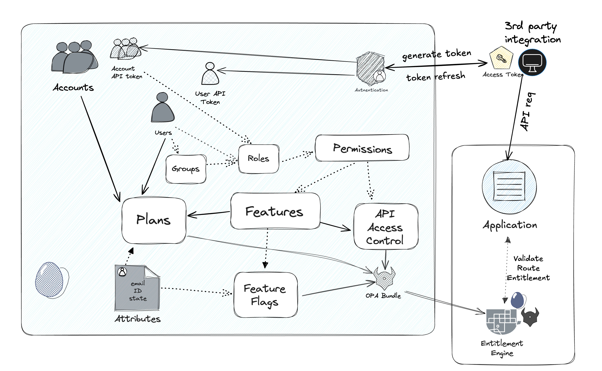

# Frontegg API Access Control

This project demonstrates how to implement API access control using Frontegg's entitlements agent.



## Table of Contents

- [Features](#features)
- [Prerequisites](#prerequisites)
- [Setup](#setup)
- [Usage](#usage)
- [How to Query Entitlement Engine Without SDK](#how-to-query-entitlement-engine-without-sdk)

## Features

- JWT-based authentication
- API access control using Frontegg's entitlements

## Prerequisites

- Docker
- Frontegg account
- Node.js
- npm or yarn

## Setup

1. Install dependencies:
   ```
   npm install
   ```

2. Create a `.env` file in the root directory and add the following environment variables:

   ```
   PDP_HOST=http://localhost:8181
   PORT=3000
   JWT_SECRET='-----BEGIN PUBLIC KEY-----
   YOUR
   PUBLIC
   KEY
   -----END PUBLIC KEY-----'
   ```
   
   - `PDP_HOST`: Policy decision point host
   - `PORT`: Port of the application (default 3000)
   - `JWT_SECRET`: JWT token public key (Frontegg portal => Authentication => JWT => JWT Signature)

3. Start the server:
   ```
   npm start
   ```

4. [Create API policies](https://docs.frontegg.com/docs/creating-your-first-route)
5. [Configure and start FrontEgg Entitlements Agent](https://docs.frontegg.com/docs/configuring-and-running-the-engine)
   
   * [Get your FrontEgg credentials](https://docs.frontegg.com/docs/configuring-and-running-the-engine#step-2-run-the-agent-as-a-docker-container)

     - `FRONTEGG_CLIENT_ID`: FrontEgg environment ClientId.
     - `FRONTEGG_CLIENT_CREDENTIALS_OAUTH_CLIENT_ID`: FrontEgg portal Personal token clientId.
     - `FRONTEGG_CLIENT_CREDENTIALS_OAUTH_SECRET`: FrontEgg portal Personal token secret 

   * Pull the latest version of the entitlement engine:

      ```
      docker pull frontegg/entitlements-agent:latest
      ```
   
   * Start the engine:   

   ```
   docker run -p 8181:8181 \
   -e FRONTEGG_CLIENT_ID=<YOUR_CLIENT_ID> \
   -e FRONTEGG_CLIENT_CREDENTIALS_OAUTH_CLIENT_ID=<YOUR_PERSONAL_TOKEN_CLIENT_ID> \
   -e FRONTEGG_CLIENT_CREDENTIALS_OAUTH_SECRET=<YOUR_PERSONAL_TOKEN_SECRET> \
   -e FRONTEGG_REGION=<eu|us|au|ca> \
   frontegg/entitlements-agent
   ```

## Usage

The server will start on `http://localhost:3000` (or the `PORT` specified in your environment variables).

1. [Generate M2M token](https://docs.frontegg.com/docs/time-bound-token-expiration) 

   Use the hosted admin portal if you don't have an embedded one in your application: 
   https://[your_environment_domain].frontegg.com/oauth/portal

2. Validate API route with entitlements:
   ```
   curl http://localhost:3000/data -H 'authorization: Bearer <token>'
   ```

## How to query Entitlement Engine without SDK
If SDK is not available for your framework, you can query it directly via API

```
POST /v1/data/e10s/routes/is_entitled_to_input_route
{
  "input": {
    "subjectContext": {
      "userId": string | null,
      "tenantId": string,
      "permissions": string[],
      "attributes": Record<string, unknown>
    },
    "requestContext": {
      "method": string, 
      "path": string
    }
  }
}
```

Response:
```
{
	"result": {
		"result": boolean;
		"justification": string;
		"monitoring": true; // In case monitoring mode is on
	};
}
```

* `justification` - if `result` is `false`:  
   
   - `MISSING_FEATURE`: User/Tenant is not entitled to the feature of this route.    
   - `MISSING_PERMISSION`: User/Tenant is missing permission to access this route.   
   - `MISSING_ROUTE`: Route is not configured.   
   - `PLAN_EXPIRED`: Plan that enabled that route is expired for user/tenant.  
   - `ROUTE_DENIED`: Route denied for the user/tenant. 

